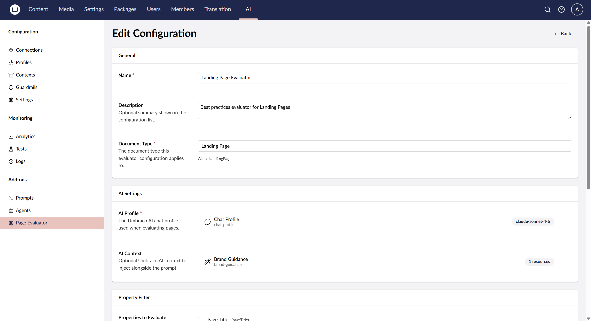
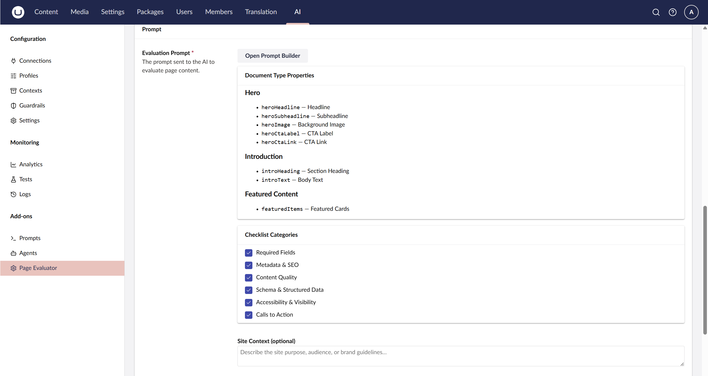
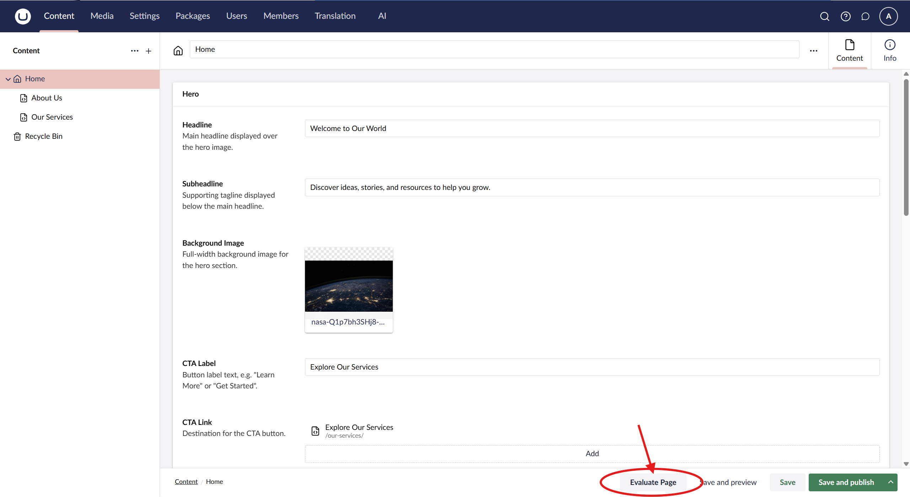
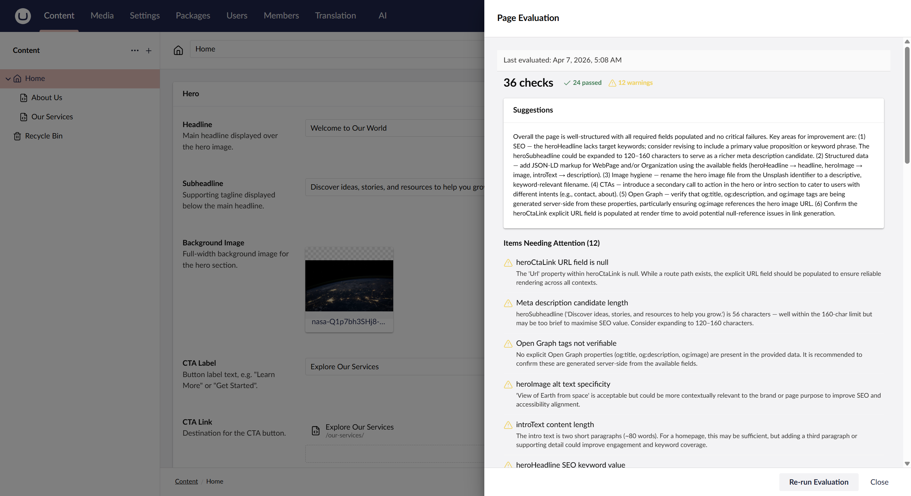
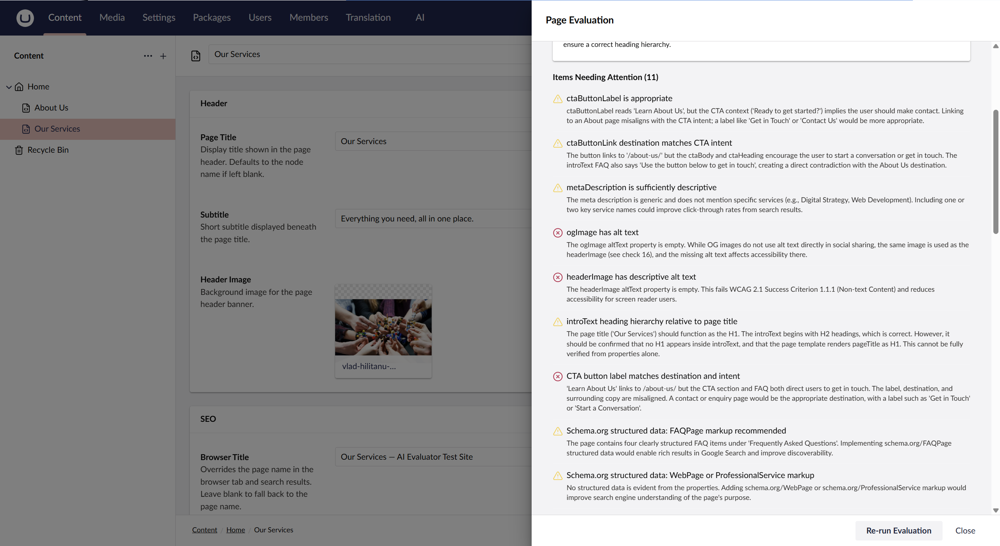

# ProWorks Umbraco AI Page Evaluator

An Umbraco 17 backoffice package that adds an **Evaluate Page** button to the content editor toolbar. When clicked, it sends the current page's content to an AI model and returns a structured quality report — scored checks, warnings, and actionable suggestions — directly inside the backoffice.

---

## Features

- **One-click evaluation** from the document workspace toolbar
- **Structured report**: per-check pass / warn / fail status with explanations, overall score, and a suggestions summary
- **Evaluation caching**: results are cached per content node — re-opening the modal shows the previous result instantly with a timestamp; a **Re-run Evaluation** button forces a fresh AI call
- **Configurable per document type**: create named evaluator configurations with custom prompts in the Umbraco.AI Add-ons section; activate, edit, or delete configurations from the list view
- **Prompt Builder**: guided UI for generating evaluation prompts from document type properties and checklist categories
- **AI provider agnostic**: works with any profile configured in Umbraco.AI (Anthropic, OpenAI, etc.)
- **Property filtering**: optionally select which properties to include in evaluations — reduce token usage by excluding irrelevant fields
- **Rich property resolution**: uses Umbraco's Content Delivery API builder to send properly resolved property values — media alt text, block content, rich text as plain text, MNTP references — rather than raw editor format
- **Content cleaning**: HTML tags are stripped and long property values are truncated before sending to the AI, reducing token consumption
- **Draft-aware**: overlays unsaved text edits on top of the published content snapshot so unevaluated changes are included
- **Security hardened**: admin-only config management, generic error responses, prompt injection defense, and per-user audit trail

---

## Requirements

| Dependency | Version |
|---|---|
| Umbraco CMS | 17.2.x |
| Umbraco.AI | 1.7.x |
| .NET | 10 |

---

## Getting Started

### 1. Install the package

Install via NuGet:

```bash
dotnet add package ProWorks.Umbraco.AI.PageEvaluator
```

Or search for **ProWorks.Umbraco.AI.PageEvaluator** in the NuGet Package Manager in Visual Studio.

Package page: https://www.nuget.org/packages/ProWorks.Umbraco.AI.PageEvaluator

### 2. Configure an AI profile

In the Umbraco backoffice, go to **Settings → Umbraco.AI → Profiles** and create or verify an AI profile (Anthropic Claude is recommended for evaluation tasks).

### 3. Create an Evaluator Configuration

Go to **Settings → AI Add-ons → Page Evaluator**.

1. Click **Create New Configuration**
2. Select the **Document Type** you want to evaluate
3. Choose the **AI Profile**
4. Optionally select specific **properties to evaluate** (if none are selected, all properties are sent)
5. Write or generate an evaluation prompt (use the **Prompt Builder** to auto-generate one from the document type's properties)
6. Optionally attach a **Context** resource from Umbraco.AI
7. Save and set the configuration to **Active**



The **Prompt Builder** lists the document type's properties and checklist categories, then generates a ready-to-use evaluation prompt:



### 4. Evaluate a page

Open any published content node of the configured document type. An **Evaluate Page** button appears in the workspace toolbar. Click it to run the evaluation.



The modal displays a structured report with scored checks, suggestions, and items needing attention:



Scroll down for detailed explanations of each check and actionable recommendations:



---

## How It Works

```
Editor clicks "Evaluate Page"
        │
        ▼
Modal opens → GET /evaluate/cached/{nodeId}
        │
        ├─ Cache hit → renders report immediately with "Last evaluated" timestamp
        │              "Re-run Evaluation" button available to force a fresh call
        │
        └─ Cache miss (or Re-run) →
                │
                ▼
        Workspace action collects draft property values
                │
                ▼
        POST /umbraco/management/api/v1/page-evaluator/evaluate
                │
                ├─ Fetches the active evaluator config for the document type
                ├─ Resolves published property values via IApiContentBuilder
                │   (media → metadata, rich text → plain text, blocks → structured JSON)
                ├─ Filters to selected properties only (if PropertyAliases configured)
                ├─ Strips HTML tags and truncates long values (2000 char limit)
                ├─ Overlays simple draft text values for unsaved edits
                ├─ Builds system prompt (config prompt + optional context + JSON format instructions)
                ├─ Adds defensive preamble to guard against prompt injection from content
                └─ Calls the AI model via IAIChatService (Temperature=0, JSON format)
                        │
                        ▼
                Parses JSON response → EvaluationReport
                        │
                        ▼
                Saved to umbracoAIEvaluationCache (keyed on NodeId)
                        │
                        ▼
                Modal renders: score pills · suggestions · attention items · passing items
```

> Cache is automatically cleared for all nodes of a document type whenever its evaluator configuration is created, updated, activated, or deleted. Cache entries for individual nodes are also cleared when content is published.

---

## Contributing

See [README-DEV.md](README-DEV.md) for project structure, build instructions, architecture notes, and database migration commands.

---

## About ProWorks

<a href="https://www.proworks.com"></a>

[ProWorks Corporation](https://www.proworks.com/umbraco-platinum-partner/) is an **Umbraco Platinum Partner** based in Corvallis, Oregon. We have been building and maintaining Umbraco implementations since the early versions of the platform — certified across Umbraco 7 through 17 LTS — and we carry three Umbraco MVPs on staff. Platinum status at ProWorks reflects sustained delivery quality, deep platform expertise, and ongoing community involvement through open-source packages, conference talks, and ecosystem advisory boards. This package is one example of that work.

We work with organizations across regulated industries — credit unions, insurers, public agencies, and manufacturers — and have delivered projects for clients including NASA, Microsoft, and Cal Fire. Our approach is consultative: we will meet you where you are and recommend the right next step, even if that means doing less.

### AI Services

Beyond this open-source package — which evaluates individual pages on demand — ProWorks offers a **site-wide Content Evaluator service** that analyzes how AI systems understand your organization across your entire website. We deliver an **AI Perspective Report** covering your AI-inferred positioning, value propositions, audience signals, and content consistency — based entirely on your publicly available content. As AI systems increasingly answer questions directly before anyone visits your site, understanding how you are interpreted at scale is a practical first step.

Learn more at [proworks.com/ai](https://www.proworks.com/ai).

### Get in Touch

If you have questions about this package, need help with an Umbraco project, or want to discuss the site-wide AI evaluation service, [contact us through our website](https://www.proworks.com/contact).

---

## License

MIT
