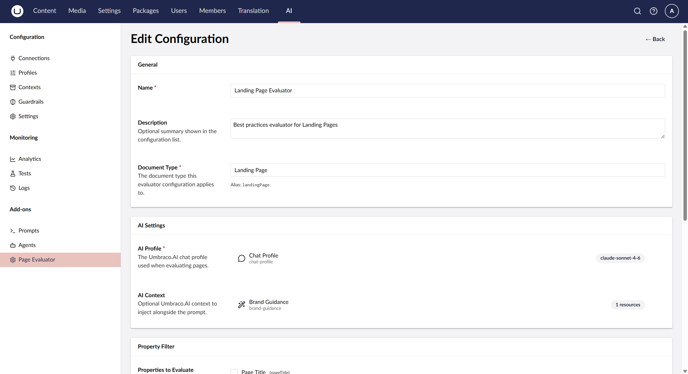
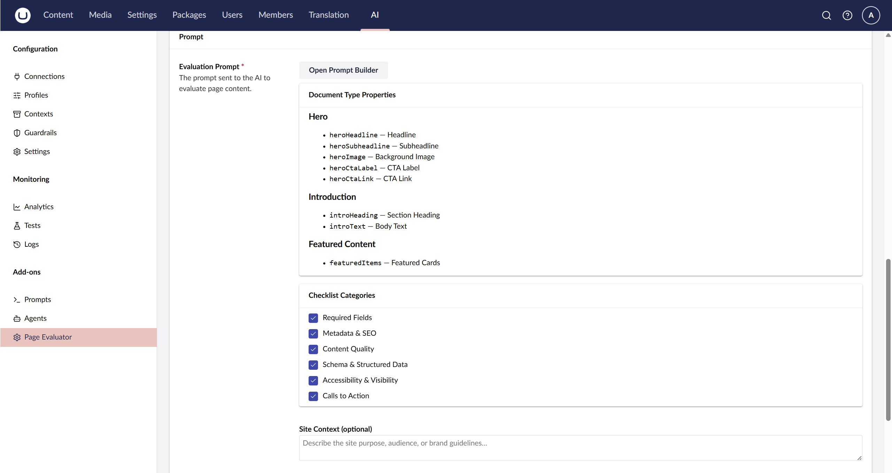
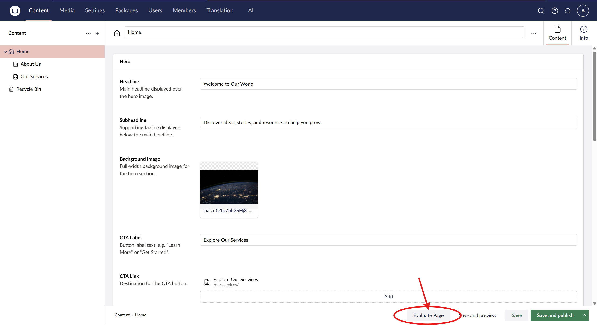
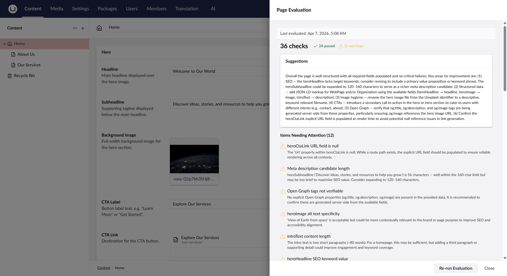
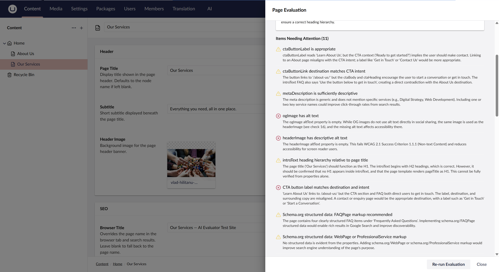
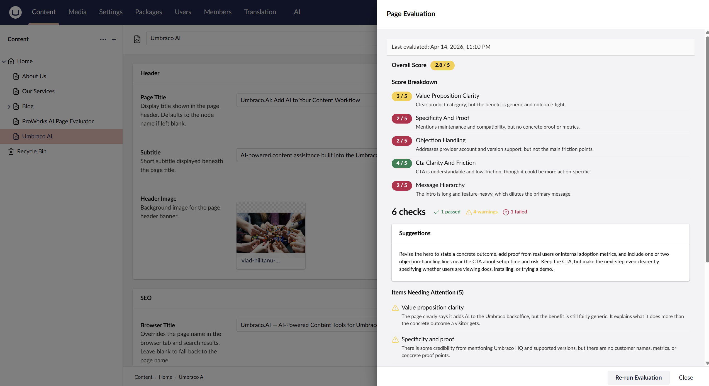

# ProWorks Umbraco AI Page Evaluator

An Umbraco 17 backoffice package that adds an **Evaluate Page** button to the content editor toolbar. When clicked, it sends the current page's content to an AI model and returns a structured quality report directly inside the backoffice, including scored checks, warnings, and actionable suggestions.

---

## Features

- **One-click evaluation** from the document workspace toolbar
- **Structured report**: per-check pass / warn / fail status with explanations, overall score, and a suggestions summary
- **Evaluation caching**: results are cached per content node, so re-opening the modal shows the previous result instantly with a timestamp. A **Re-run Evaluation** button forces a fresh AI call
- **Configurable per document type**: create named evaluator configurations with custom prompts in the Umbraco.AI Add-ons section; activate, edit, or delete configurations from the list view
- **Prompt Builder**: guided UI for generating evaluation prompts from document type properties and checklist categories
- **AI provider agnostic**: works with any profile configured in Umbraco.AI (Anthropic, OpenAI, etc.)
- **Property filtering**: optionally select which properties to include in evaluations to reduce token usage by excluding irrelevant fields
- **Rich property resolution**: uses Umbraco's Content Delivery API builder to send properly resolved property values (media alt text, block content, rich text as plain text, MNTP references) rather than raw editor format
- **Content cleaning**: HTML tags are stripped and long property values are truncated before sending to the AI, reducing token consumption
- **Draft-aware**: overlays unsaved text edits on top of the published content snapshot so unevaluated changes are included
- **AI text recommendations**: for any Fail or Warn check that targets a specific property, a **Generate recommendation** button fetches an AI-suggested replacement value. Recommendations are property-editor-aware: plain text and Tags fields offer full apply + copy; Rich Text fields offer copy-only (since the Umbraco RTE stores a JSON envelope that cannot be replaced by plain text); complex fields such as media pickers and block lists are excluded automatically
- **Guardrail policy support**: when the AI profile has guardrail rules that block an evaluation (pre- or post-generate), the modal shows a specific message identifying which policy fired rather than a generic error; transient AI provider overload errors (e.g. Anthropic 529) are detected and shown as a "temporarily unavailable, please retry" prompt
- **Security hardened**: admin-only config management, generic error responses (provider details are never leaked to the client), prompt injection defense, and per-user audit trail
- **Umbraco.AI Test Support**: fully supports multi-run tests and results evaluation to compare evaluations accross models and package releases.

---

## Requirements

| Dependency | Version |
|---|---|
| Umbraco CMS | 17.4.x |
| Umbraco.AI | 1.11.x |
| .NET | 10 |

---

## Getting Started

### 1. Install the package

Install via NuGet:

```bash
dotnet add package ProWorks.Umbraco.AI.PageEvaluator
```

Or search for **ProWorks.Umbraco.AI.PageEvaluator** in the NuGet Package Manager in Visual Studio.

Package page: https://www.nuget.org/packages/ProWorks.Umbraco.AI.PageEvaluator

### 2. Configure an AI profile

In the Umbraco backoffice, go to **AI > Connections** and **AI > Profiles** create or verify an AI profile with a connection.

### 3. Create an Evaluator Configuration

Go to **AI > Page Evaluator**.

1. Click **Create New**
2. Select the **Document Type** you want to evaluate
3. Choose the **AI Profile**
4. Optionally select specific **properties to evaluate** (if none are selected, all properties are sent)
5. Write or generate an evaluation prompt (use the **Prompt Builder** to auto-generate one from the document type's properties)
6. Optionally attach a **Context** resource from Umbraco.AI
7. Save and set the configuration to **Active**



The **Prompt Builder** lists the document type's properties and checklist categories, then generates a ready-to-use evaluation prompt:



### 4. Evaluate a page

Open any published content node of the configured document type. An **Evaluate Page** button appears in the workspace toolbar. Click it to run the evaluation.



The modal displays a structured report with scored checks, suggestions, and items needing attention:



Scroll down for detailed explanations of each check and actionable recommendations:



When dimensional scoring is enabled, the report also shows an overall score and a per-dimension breakdown with color-coded ratings:



---

## Contributing

See [README-DEV.md](README-DEV.md) for project structure, build instructions, architecture notes, and database migration commands.

---

## About ProWorks

<a href="https://www.proworks.com"></a>

[ProWorks Corporation](https://www.proworks.com/umbraco-platinum-partner/) is an **Umbraco Platinum Partner** based in the USA. We have been building and maintaining Umbraco implementations since the early versions of the platform, certified across Umbraco 7 through 17 LTS, and we have three Umbraco MVPs on staff. Platinum status at ProWorks reflects sustained delivery quality, deep platform expertise, and ongoing community involvement through open-source packages, conference talks, and ecosystem advisory boards. This package is one example of that work.

 We work with organizations across many industries including credit unions, insurers, public agencies, travel, higher education, and manufacturers, and have delivered projects for clients including NASA, Microsoft, and Cal Fire. Our approach is consultative: we will meet you where you are and recommend the right next step, even if that means doing less.

### AI Services

This open-source package evaluates individual pages on demand. ProWorks also offers a **site-wide Content Evaluator service** that analyzes how AI systems understand your organization across your entire website. We deliver an **AI Perspective Report** covering your AI-inferred positioning, value propositions, audience signals, and content consistency, based entirely on your publicly available content. As AI systems increasingly answer questions directly before anyone visits your site, understanding how you are interpreted at scale is a practical first step.

Learn more at [proworks.com/ai](https://www.proworks.com/ai).

### Get in Touch

If you have questions about this package, need help with an Umbraco project, or want to discuss the site-wide AI evaluation service, [contact us through our website](https://www.proworks.com/contact).

---

## License

MIT
