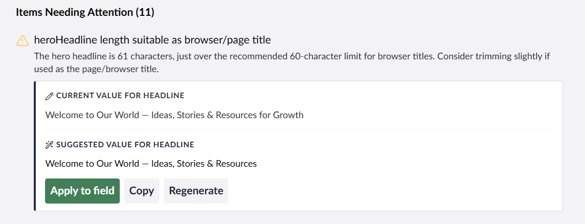

# ProWorks Umbraco AI Page Evaluator

[](https://www.nuget.org/packages/ProWorks.Umbraco.AI.PageEvaluator/)
[](https://www.nuget.org/packages/ProWorks.Umbraco.AI.PageEvaluator)
[](./LICENSE)

An Umbraco 17 backoffice package that adds an **Evaluate Page** button to the content editor toolbar. When clicked, it sends the current page's content to an AI model and returns a structured quality report directly inside the backoffice, including scored checks, warnings, and actionable suggestions.

---

## Features

- **One-click evaluation** from the document workspace toolbar
- **Structured report**: per-check pass / warn / fail status with explanations, overall score, and a suggestions summary
- **Evaluation caching**: results are cached per content node (and per language on multilingual sites), so re-opening the modal shows the previous result instantly with a timestamp. A **Re-run Evaluation** button forces a fresh AI call. Publishing or unpublishing a language clears only that language's cached result
- **Multilingual aware**: on a site with several languages, the evaluation covers the language you're viewing (plus shared, non-varying properties), recommendations are written in that language, and **Apply** writes only to that language's fields
- **Configurable per document type**: create named evaluator configurations with custom prompts in the Umbraco.AI Add-ons section; activate, edit, or delete configurations from the list view
- **Prompt Builder**: guided UI for generating evaluation prompts from document type properties and checklist categories
- **AI provider agnostic**: works with any profile configured in Umbraco.AI (Anthropic, OpenAI, etc.)
- **Property filtering**: optionally select which properties to include in evaluations to reduce token usage by excluding irrelevant fields
- **Rich property resolution**: uses Umbraco's Content Delivery API builder to send properly resolved property values (media alt text, block content, rich text as plain text, MNTP references) rather than raw editor format
- **Content cleaning**: HTML tags are stripped and long property values are truncated before sending to the AI, reducing token consumption
- **Draft-aware**: overlays unsaved text edits on top of the published content snapshot so unevaluated changes are included
- **AI text recommendations**: for any Fail or Warn check that targets a specific property, a **Generate recommendation** button fetches an AI-suggested replacement value. The recommendation box shows the property's current value alongside the suggestion so editors can compare before applying. Recommendations are property-editor-aware: plain text, Tags and **Rich Text** fields offer full apply + copy; complex fields such as media pickers and block lists are excluded automatically. For Rich Text with embedded blocks or media, Apply is only offered when the suggestion keeps every embedded item — otherwise you get Copy and an explanation, so embedded content is never lost. Third-party or custom property editors can be enabled for recommendations via `appsettings.json` (see [Configuration options](#configuration-options))
- **Guardrail policy support**: when the AI profile has guardrail rules that block an evaluation (pre- or post-generate), the modal shows a specific message identifying which policy fired rather than a generic error
- **Distinct AI failure messages**: transient provider overloads, rate limits, timeouts and aborted requests show a "temporarily unavailable, please retry" prompt; network/connectivity failures reaching the provider show a distinct connectivity message; authentication or configuration problems (e.g. an invalid AI connection credential) show a message directing editors to contact their administrator; gateway timeouts and unreachable gateways (proxies/CDNs in front of the backoffice) get their own messages — never a generic "fatal error"
- **Reliable structured output**: evaluations and recommendations ask the AI provider to enforce the expected JSON structure where it supports it, with an automatic one-time fallback to the tolerant parser for models that reject it
- **Security hardened**: admin-only config management, generic error responses (provider details are never leaked to the client), prompt injection defense, and per-user audit trail
- **Umbraco.AI Test Support**: fully supports multi-run tests and results evaluation to compare evaluations across models and package releases.

---

## Requirements

| Dependency | Version |
|---|---|
| Umbraco CMS | 17.6.2 or later 17.x |
| Umbraco.AI | 17.3.4 or later 17.x (Core/Startup; with Anthropic 17.1+, OpenAI 17.2+, Agent 17.1+) |
| .NET | 10 |

**Upgrading from 17.0.x of this package?** Upgrade Umbraco CMS to 17.6.2+ and the Umbraco.AI packages to 17.3.4+ first, then this package. The package depends on `Umbraco.Cms` 17.6.2+, so on an older site the install fails with `NU1605: Detected package downgrade: Umbraco.Cms from 17.6.2 to …`: upgrade the platform first rather than working around that error. On first start the package migrates its evaluation cache table (existing cached results are kept).

---

## Getting Started

### 1. Install the package

Install via NuGet:

```bash
dotnet add package ProWorks.Umbraco.AI.PageEvaluator
```

Or search for **ProWorks.Umbraco.AI.PageEvaluator** in the NuGet Package Manager in Visual Studio.

Package page: https://www.nuget.org/packages/ProWorks.Umbraco.AI.PageEvaluator

### 2. Configure an AI profile

In the Umbraco backoffice, go to **AI > Connections** and **AI > Profiles** create or verify an AI profile with a connection.

### 3. Create an Evaluator Configuration

Go to **AI > Page Evaluator**.

1. Click **Create New**
2. Select the **Document Type** you want to evaluate
3. Choose the **AI Profile**
4. Optionally select specific **properties to evaluate** (if none are selected, all properties are sent)
5. Write or generate an evaluation prompt (use the **Prompt Builder** to auto-generate one from the document type's properties)
6. Optionally attach a **Context** resource from Umbraco.AI
7. Save and set the configuration to **Active**


The **Prompt Builder** lists the document type's properties and checklist categories, then generates a ready-to-use evaluation prompt:


### 4. Evaluate a page

Open any published content node of the configured document type. An **Evaluate Page** button appears in the workspace toolbar. Click it to run the evaluation.


The modal displays a structured report with scored checks, suggestions, and items needing attention:


Scroll down for detailed explanations of each check and actionable recommendations:


When dimensional scoring is enabled, the report also shows an overall score and a per-dimension breakdown with color-coded ratings:


When recommendations are enabled, the report allows the user to ask AI for a recommendation of the property value and apply it directly to the page.




---

## Configuration options

The package reads optional settings from `appsettings.json` under the `ProWorks:PageEvaluator` section.

### Additional recommendable editor aliases

By default only the built-in Umbraco editors listed above support recommendations. To enable recommendations for editors from third-party or custom packages, list their aliases in `appsettings.json`:

```json
"ProWorks": {
  "PageEvaluator": {
    "AdditionalRecommendableEditorAliases": [
      "MyPackage.CustomTextEditor",
      "AnotherPackage.SimpleText"
    ]
  }
}
```

Editors listed here are treated as plain-text fields and receive both the **Recommend** and **Apply** buttons in the evaluation modal. Alias comparison is case-insensitive. Built-in Umbraco editors (`Umbraco.TextBox`, `Umbraco.TextArea`, `Umbraco.Markdown`, `Umbraco.Tags`, `Umbraco.RichText`, `Umbraco.TinyMCE`) do not need to be listed here.

---

## Evaluation behaviour

### Saving cost on re-runs (Anthropic prompt caching)

Umbraco.AI 17.3 adds optional prompt caching for Anthropic profiles (**AI > Profiles > your profile > capability settings > Prompt caching**, `5m` or `1h`). The evaluator sends the same system prompt for every page of a document type, so enabling caching on the evaluator's profile can reduce input-token cost for repeated evaluations. Cached-token counts appear in Umbraco.AI's usage reporting.

### Usage and audit reporting

Evaluations and recommendations run under two different inline-chat aliases (`proworks-page-evaluator` and `proworks-page-evaluator-recommend`), so they appear as separate feature identities in the Umbraco.AI **audit log** and can be filtered separately. Umbraco.AI's usage statistics group by provider, model, profile and user rather than by feature — to see evaluation and recommendation costs separately there, give each its own AI profile.

### Scores may vary on some AI models

The evaluator asks for deterministic output (`temperature = 0`) so that re-running an evaluation on unchanged content gives the same scores. Since Umbraco.AI 17.3, providers declare which models accept that setting and Umbraco.AI silently drops it for the ones that don't — for example OpenAI's reasoning models (o-series, GPT-5) and newer Claude models. On those models, scores can differ between re-runs of the same page.

The package tells you when this applies: the evaluator configuration screen shows a notice under the AI profile picker when the selected profile's model ignores the setting, and every report produced by such a model (fresh or cached) carries the same notice. For the most repeatable scores, use a profile whose model supports temperature.

---

## Contributing

See [README-DEV.md](README-DEV.md) for project structure, build instructions, architecture notes, and database migration commands.

---

## About ProWorks

<a href="https://www.proworks.com"></a>

[ProWorks Corporation](https://www.proworks.com/umbraco-platinum-partner/) is an **Umbraco Platinum Partner** and **Umbraco Contributing Partner** based in the USA. We have been building and maintaining Umbraco implementations since the early versions of the platform, certified across Umbraco 4 through 17, and we have three Umbraco MVPs on staff. Platinum status at ProWorks reflects sustained delivery quality, deep platform expertise, and ongoing community involvement through open-source packages, conference talks, and ecosystem advisory boards. This package is one example of that work.

 We work with organizations across many industries including credit unions, insurers, public agencies (federal, state, and local), travel, higher education, healthcare, and manufacturers. We have delivered projects for clients including NASA, Microsoft, University of Nevada-Reno, Co-op Solutions, USDA, and Cal Fire. Our approach is consultative: we will meet you where you are and recommend the right next step, even if that means doing less.

### AI Services

This open-source package evaluates individual pages on demand. ProWorks also offers a **site-wide Content Evaluator service** that analyzes how AI systems understand your organization across your entire website to support AEO and GEO success. We deliver an **AI Perspective Report** covering your AI-inferred positioning, value propositions, audience signals, and content consistency, based entirely on your publicly available content. As AI systems increasingly answer questions directly before anyone visits your site, understanding how you are interpreted at scale is a practical first step.

Learn more at [proworks.com/ai](https://www.proworks.com/ai).

### Get in Touch

If you have questions about this package, need help with an Umbraco project, or want to discuss the site-wide AI evaluation service, [contact us through our website](https://www.proworks.com/contact).

---

## License

MIT
